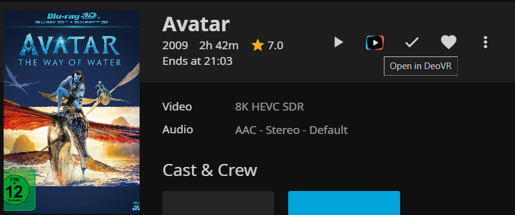

# DeoVR Deeplink Proxy Plugin for Jellyfin

> [!CAUTION]
> Configure <b>IP Restrictions</b> in Plugin settings if your Jellyfin server is public or in an untrusted network!

A plugin for Jellyfin that adds (partial) support with [DeoVR](https://deovr.com/app)
Allows direct browsing when you open jellyfin with DeoVR.

## Features

- **DeoVR Browsing** Browse your Libraries in DeoVR
- **Video scrubbing in DeoVR** Optionally generate timeline images to allow video scrubbing (optional)
- **UI Changes:** adds a 'Play in DeoVR' button
- **Secure signed links:** Temporary, HMAC-signed links for proxying video streams.
- **DeoVR-compatible JSON responses:** Works seamlessly with [DeoVR](https://deovr.com/app/doc).

## Preview



---

## Getting Started

### Prerequisites

- [Jellyfin Media Server](https://jellyfin.org/) with a valid https certificate
- DeoVR for testing client integration (optional)

## Installation ##

### Jellyfin Web Client (Server) ###
1. Add the manifest `https://raw.githubusercontent.com/toastyice/DeoVRDeeplink/master/manifest.json` as a Jellyfin plugin repository to your server.
2. Install the plugin `DeoVRDeeplink` from the repository.
3. Restart the Jellyfin server.

### Configuration

- In the Jellyfin dashboard, configure:
  - **Proxy Secret:** _(A strong random string used for signing proxy URLs)_.
  - **Fallback Projection Type:** _(Force a projection type if the film's metadata does not indicate the mode.)_.
  - **Fallback Stereo Mode:** _(Force a stereo mode if the film's metadata doesn't indicate it)_.
  - **IP Restriction:** _(Configure IP restrictions for the json and proxy endpoints)_.
  - **Timeline** _(Optionally generate timeline images for specific libraries)_.

### Usage

1. **DeoVR Integration:**  
    Simply open DeoVR and enter your Jellyfin URL
    OR
    Click 'Open in DeoVR' Button

## Security

- Streams are protected with expiring, HMAC-signed tokens.
- Links cannot be forged or reused after expiry.
- Secret is never sent to the client.
- The expiry time is twice the length of the film.
- Optional IP restrictions on all routes expect script and icon

---

## Advanced

- **endpoints:**
  - `/deovr`
  - `/deovr/ClientScript`
  - `/deovr/Icon`
  - `/deovr/json/<MovieUUID>/response.json`
  - `/deovr/proxy/<MovieUUID>/<Expiry>/<Signature>/stream.mp4`
  - `/deovr/timeline/<MovieUUID>/4096_timelinePreview341x195.jpg`

---

## Development

- Fork and clone this repository.
- Build with your preferred .NET IDE or `dotnet` CLI.
- Contributions and PRs welcome!

---

## Troubleshooting ##

### 1. The button isn't visible ###
This is most likely related to wrong permissions for the `index.html` file.

#### 1.1 Change Ownership inside a docker container ####

If you're running jellyfin in a docker container, you can change the ownership with thie following command
(replace jellyfin with your containername, user and group with the user and group of your container):

```bash
docker exec -it --user root jellyfin chown user:group /jellyfin/jellyfin-web/index.html && docker restart jellyfin
```

You can run this as a cron job on system startup.

(Thanks to [muisje](https://github.com/muisje) for helping with [this](https://github.com/Namo2/InPlayerEpisodePreview/issues/49#issue-2825745530) solution)

#### 1.2 Change Ownership running on a Windows installation ####
1. Navigate to: `C:\Program Files\Jellyfin\Server\jellyfin-web\`
2. Right-click on `index.html` → `Properties` → `Security tab` → Click on `Edit`
3. Select your user from the list and check the Write `permission` box.
4. Restart both the server and client.

(Thanks to [xeuc](https://github.com/xeuc) for [this](https://github.com/Namo2/InPlayerEpisodePreview/issues/49#issuecomment-2746136069) solution)

If this does not work, please follow the discussion in [this](https://github.com/Namo2/InPlayerEpisodePreview/issues/10) (or [this](https://github.com/Namo2/InPlayerEpisodePreview/issues/49)) issue.

### 2. The Film doesn't start/load in DeoVR ###

Make sure that your Jellyfin server is configured to use HTTPS and that it has a valid certificate.
If you are using a reverse proxy, check that everything is set up correctly.

<br/>
If you encounter any error which you can't solve yourself, feel free to open up an issue.
<br/>Please keep in mind that any system is different which can lead to unexpected behaviour, so add as much information about it as possible.
<br/>Jellyfin logs and console logs from the browser (prefixed as [InPlayerEpisodePreview]) are always useful.

---

## Credits
- This plugin was inspired by a lack of a proper VR player that supports Jellyfin
- [Jellyfin Media Server](https://jellyfin.org/)
- [DeoVR](https://deovr.com/)
- [InPlayerEpisodePreview (Heavily inspired the way the UI is edited)](https://github.com/Namo2/InPlayerEpisodePreview)
---

**Happy streaming!**
